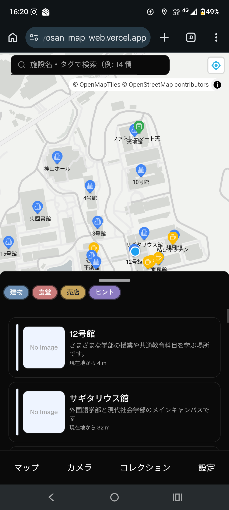
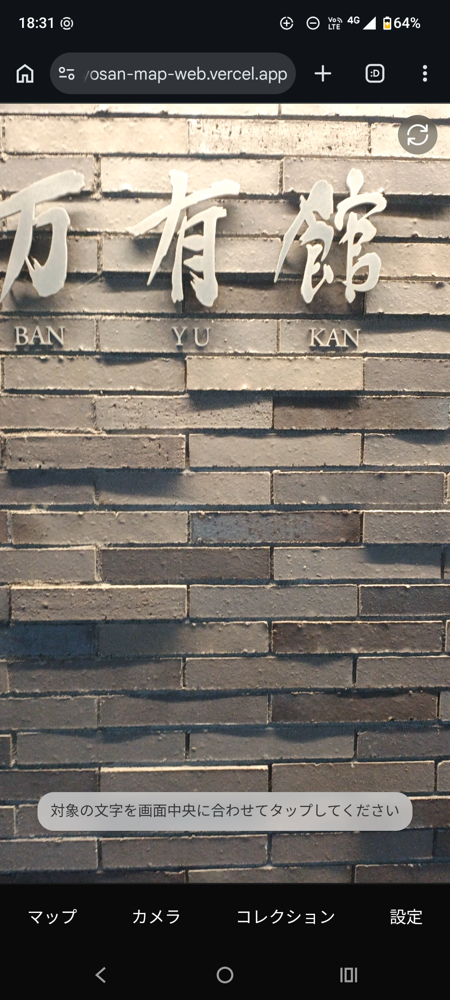
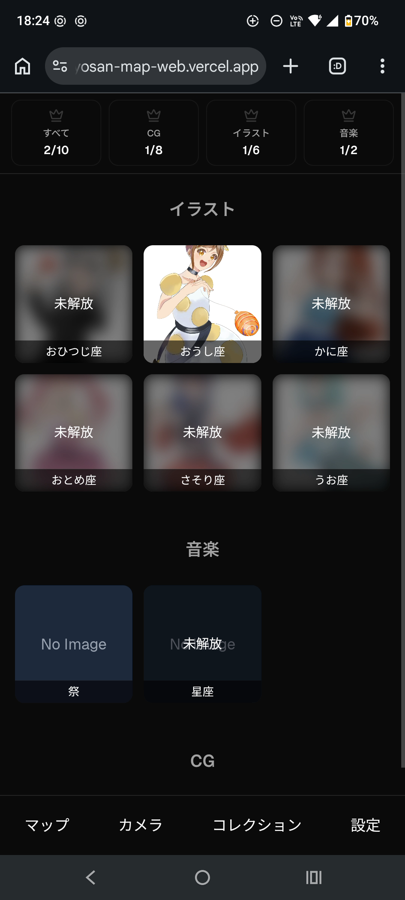

# kyosan-map

`kyosan-map` は、地図・カメラ OCR・コンテンツ収集を組み合わせた体験型の Web アプリケーションです。  
キャンパス内の施設を地図上で探索し、カメラで施設名を認識し、対応するコンテンツを解放してコレクションとして閲覧できます。

地図表示には `MapLibre` を採用し、`style.json` とベクタータイル配信を分離した構成を取っています。  
Google Maps API の従量課金モデルに依存せず、Cloudflare Pages を使って地図タイル、OCR 資産、コンテンツ資産を分離配信している点が特徴です。

## Demo

### Screenshots

| Map | Camera | Collection |
| :---: | :---: | :---: |
|  |  |  |

### Videos

#### 1. Map Interaction (Current Location)

現在地ボタンを押した時の地図の挙動です。

<video src=https://github.com/user-attachments/assets/4ed80431-fa42-40b8-a5f8-d7d3b5e6a25f width="300" controls></video>

#### 2. OCR Scan to Collection Flow

カメラで施設名を読み取り、地図に反映され、コレクションが解放されるまでの一連の流れです。

<video src=https://github.com/user-attachments/assets/71f32bdf-a5cd-44c8-85aa-4e38638d8dfd width="300" controls></video>

## Overview

- MapLibre ベースの地図 UI で施設を表示
- 施設名やタグで施設を検索
- モバイルカメラで施設名を OCR 認識
- OCR 結果から施設を特定し、対応コンテンツを解放
- 解放済みコンテンツを画像・音声・3D モデルとして閲覧
- Google ログインと Turso/libsql を使ったユーザー別コレクション管理

## Characteristics

- `MapLibre` を使い、`style.json` とベクタータイル配信を前提にした地図体験を構成している
- Google Maps API の従量課金モデルに依存せず、Cloudflare Pages を使った低コストな配信構成を採用している
- OCR をブラウザ内で実行し、施設認識からコンテンツ解放までを一つの導線として統合している
- 地図、OCR、認証、ユーザー別コレクション管理を一つのプロダクトとして接続している

## Product Flow

1. 地図画面で施設を探す
2. カメラ画面で施設名を読み取る
3. OCR 結果から施設を特定する
4. 施設に紐づくコンテンツを解放する
5. コレクション画面で解放済みコンテンツを閲覧する

## Main Features

### 1. Interactive Map

- MapLibre を使った施設マップ
- `style.json` を前提にした独自スタイルの地図表示
- ベクタータイル配信を前提にした構成
- ピンのカテゴリ分け表示
- 検索バーによる施設検索
- drawer UI を使った施設一覧・詳細導線

### 2. Camera OCR

- モバイルカメラから映像を取得
- 自作の `OnnxOcrJs` を含む `onnx-ocr-js` ベースの構成と `onnxruntime-web`、OpenCV.js によるブラウザ OCR
- タップした位置に最も近い OCR 結果を採用
- OCR 結果を施設マスタと照合して施設を特定

### 3. Unlockable Contents

- 施設ごとにコンテンツ ID を紐付け
- スキャン成功時にコンテンツを解放
- 解放状況をユーザー単位で保持
- 画像・音声・3D モデルをコレクション画面で閲覧

## Tech Stack

- Frontend: Next.js 15, React 19, TypeScript
- Map: MapLibre GL, react-map-gl
- OCR: `onnx-ocr-js`, `onnxruntime-web`, OpenCV.js
- UI: Tailwind CSS, Radix UI, shadcn/ui ベース component
- Auth: NextAuth v5 beta, Google Provider
- Database: Turso / libsql, Drizzle ORM
- Monorepo: pnpm workspace, Turbo
- Asset Delivery: Cloudflare Pages

## Repository Structure

```text
kyosan-map/
├── apps/
│   ├── web/         # 本番用 Next.js アプリ
│   └── dev/         # package 単位の検証用アプリ
├── packages/
│   ├── map/         # 地図 UI と施設表示ロジック
│   ├── out-camera/  # OCR・カメラ処理
│   ├── db/          # DB スキーマと接続
│   ├── shared/      # 施設マスタ JSON
│   └── ui/          # 共通 UI コンポーネント
└── ARCHITECTURE.md  # 詳細な内部構造メモ
```

## Related Projects

このリポジトリは単体では完結せず、関連プロジェクトと組み合わせて動作します。

- [map-tile-server](https://github.com/SotaTne/map-tile-server)
  - 地図タイルを生成・配信するリポジトリ
- [maplibre-local-viewer](https://github.com/SotaTne/maplibre-local-viewer)
  - 地図タイルや style をローカルで確認するビューア
- [ocr-file-server](https://github.com/SotaTne/ocr-file-server)
  - OCR モデル・辞書・ wasm を配信するリポジトリ
- [kyosanmap-contents-server](https://github.com/SotaTne/kyosanmap-contents-server)
  - 画像・音声・3D モデルなどの静的コンテンツを配信するリポジトリ
- [OnnxOcrJs](https://github.com/SotaTne/OnnxOcrJs)
  - ブラウザ OCR のために作成した関連ライブラリ

## External Runtime Dependencies

アプリ実行時には以下の外部配信先を参照します。

- Map style / tile:
  - `https://map-tile-server.pages.dev/style.json`
- OCR assets:
  - `https://ocr-file-server.pages.dev/`
- Contents assets:
  - `https://kyosanmap-contents-server.pages.dev/`

## Cost / Deployment Design

このプロジェクトでは、地図部分も含めて Cloudflare Pages を中心に静的配信できるように構成しています。

- 地図タイルと `style.json` を Pages で配信
- OCR モデルや wasm も Pages で配信
- 画像・音声・3D モデルも Pages で配信

この構成により、Google Maps API のような従量課金型の地図表示基盤に依存せず、低コストで運用しやすい構成を取っています。  
特に、MapLibre と Cloudflare Pages を組み合わせて地図配信を成立させている点は、このプロダクトの重要な特徴です。

## Local Development

### Requirements

- Node.js 20+
- pnpm 10+
- Turso/libsql 接続情報
- Google OAuth 設定
- `.env` に必要な認証・DB 接続情報

### Install

```bash
pnpm install
```

### Run

本番アプリ:

```bash
pnpm --filter web dev
```

検証用アプリ:

```bash
pnpm --filter dev dev
```

monorepo 全体の開発起動:

```bash
pnpm dev
```

### Database

必要な環境変数:

- `TURSO_DATABASE_URL`
- `TURSO_AUTH_TOKEN`

代表的な DB コマンド:

```bash
pnpm --filter @kyosan-map/db db:generate
pnpm --filter @kyosan-map/db db:migrate
pnpm --filter @kyosan-map/db db:seed
```

## Environment Notes

- 地図表示は外部の Cloudflare Pages 配信タイルに依存します
- OCR は外部配信されるモデルと wasm に依存します
- カメラ機能は端末ブラウザの権限と互換性に依存します
- 認証には Google OAuth の設定が必要です

## Architecture

詳細な構造は [ARCHITECTURE.md](./ARCHITECTURE.md) にまとめています。  
このドキュメントには以下を記載しています。

- monorepo の責務分割
- `apps/web` と `apps/dev` の違い
- `packages/map`, `packages/out-camera`, `packages/db`, `packages/shared` の役割
- OCR からコンテンツ解放までのデータフロー
- 外部プロジェクトとの接続点
